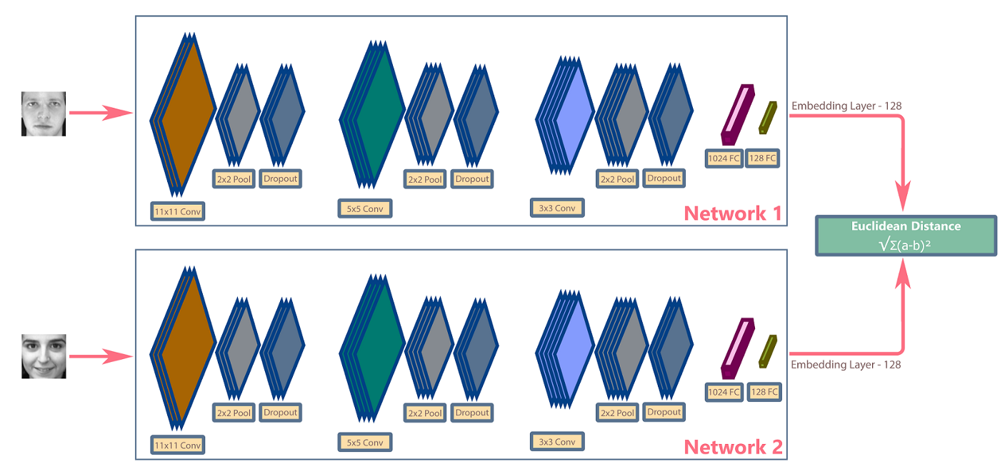

# Hawk-Eye | Backend REST API

> Hawk-Eye is a real-time facial recognition system built using React, Flask, and PostgreSQL. It uses a one-shot object classification model based on the popular Siamese network to identify suspicious persons from a centralized database.

## Frontend Web Portal

Repo for frontend web portal: [hawk-eye-frontend](https://github.com/fahadimran/hawk-eye-frontend)

## [Siamese Networks](https://medium.com/swlh/one-shot-learning-with-siamese-network-1c7404c35fda)



Siamese network inspired by Siamese twins has a unique architecture to naturally rank similarity or dissimilarity between inputs. It has the following key features:

- Siamese network takes two different inputs passed through two similar subnetworks with the same architecture, parameters, and weights.

- The two subnetworks are a mirror image of each other, just like the Siamese twins. Hence, any change to any subnetworks architecture, parameter, or weights is also applied to the other subnetwork.

- The two subnetwork outputs an encoding to calculate the difference between the two inputs.

- The Siamese network's objective is to classify if the two inputs are the same or different using the Similarity score. The Similarity score can be calculated using Binary cross-entropy, Contrastive function, or Triplet loss, which are techniques for the general distance metric learning approach.

- Siamese network is a one-shot classifier that uses discriminative features to generalize the unfamiliar categories from an unknown distribution.

_Source: [One-Shot Learning With Siamese Network](https://medium.com/swlh/one-shot-learning-with-siamese-network-1c7404c35fda)_

## System Architecture


## Documentation

Postman was used to generate API documentation. View detailed docs with sample requests and responses [here](https://documenter.getpostman.com/view/22317071/UzXKXKQk).

## Prerequisites

Ensure you have the following installed on your machine to run the backend server:

- [Python](https://www.python.org/)
- [Git](https://git-scm.com/)
- [PostgreSQL](https://www.postgresql.org/)

## Setup Locally

1. Clone the repository:

```
$ git clone https://github.com/fahadimran/hawk-eye-backend.git
$ cd hawk-eye-backend
```

2. Create a `.env` file in the root of the project and add the following values:

```
JWT_SECRET_KEY=<YOUR_JWT_SECRET>
FLASK_APP="run.py"
FLASK_ENV="development"
SQLALCHEMY_URI="postgresql://postgres:<YOUR_POSTGRESQL_PASSWORD>@localhost/hawk-eye"
UPLOAD_FOLDER=<PATH_TO_UPLOAD_FOLDER>
```

3. Create a new PostgreSQL database and name it **hawk-eye**. Then in order to initialize the database tables, run the `initdb.py` script.

```bash
$ python initdb.py
```

4. It is recommended to create a virtual environment for Python before installing any packages. Use the built-in `venv` module to do so:

```bash
$ python -m venv venv
```

5. Install the dependencies for the **Flask server**:

```bash
# Activate virtual environment - Windows
$ venv\Scripts\activate.ps1

# Install packages
$ pip install -r requirements.txt
```

**Note:** Before running `pip install`, make sure to install [CMake](https://cmake.org/download/) and [Visual Studio](https://visualstudio.microsoft.com/visual-cpp-build-tools/) and in particular the **CMake tools for Windows** package.

## Usage

Use the following command to run the **backend server**:

```
$ flask run
```

The **Flask app** runs on **[localhost:5000](http://localhost:5000/)**. You can now make requests to the server endpoints.

## Credits

For the one-shot learning algorithm we used the follwing face recognition library by **susantabiswas**. Huge shout out to his amazing work! 🙌

- [susantabiswas/FaceRecog](https://github.com/susantabiswas/FaceRecog)